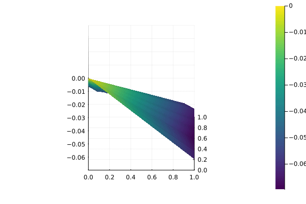

# Neural network initialization - why randomness might mislead

In the neural network sampling paper (Perakis and Tsiourvas, 2022) as well as the relaxing walk paper (Tong et al., 2024), the authors use randomly initialized neural networks for their computational experiments. The random weight initialization method used by both is the so-called Xavier initialization, and it is the default in the `Flux.jl` Julia package.

In this article I will examine the neural networks produced by Xavier initialization and explain why they might not be the best choice for testing the performance of optimization methods on the neural network.

## Xavier initialization

The following animations show randomly initialized neural networks using Xavier initialization. These networks have the structure 2-100-100-1, i.e., 2 hidden layers with 100 neurons each. The input and output dimensions have been chosen to enable easy visualization of the network. The domain is the same as in the two papers mentioned - [0, 1] for each of the input variables.

These images suggest that with random initialization, the output of the neural network is always very "boring". In fact, the output often just seems to represent a sligthly folded plane or a taut piece of fabric in the domain [0, 1]. This means that the extrema will lie on the boundary. These neural networks have no local optima and the output is approximately linear. 

Conversely, the following animation shows a neural network trained to approximate an altered version of Himmelblau's function.
It is not difficult to see why this can be a more interesting and challenging test for an optimization method.

## Conclusions

The common type of structure encountered in the examples might not be the most beneficial option for testing optimization methods because it cannot be expected to show up in every application. In addition, optimization methods that can efficiently find extrema only at the boundary or that benefit from a linear(ish) structure will seem better than they actually are. For testing any optimization method, neural networks that have been trained on a real-world dataset, or to approximate an optimization testing function (e.g. Himmelblau's functon) should be used instead of these randomly initialized models.

The limitation of these examples is the two-dimensional input used for visualization. However, although it is not clear whether the same "taut fabric" structure will show up in higher dimensions, I conjecture that at least a similar phenomenon will occur and that until proven otherwise, randomly initialized networks should not be used for testing optimization methods.

## References

*Perakis, G., & Tsiourvas, A. (2022). Optimizing Objective Functions from Trained ReLU Neural Networks via Sampling. arXiv preprint arXiv:2205.14189.*

*Tong, J., Cai, J., & Serra, T. (2024). Optimization Over Trained Neural Networks: Taking a Relaxing Walk. arXiv preprint arXiv:2401.03451.*