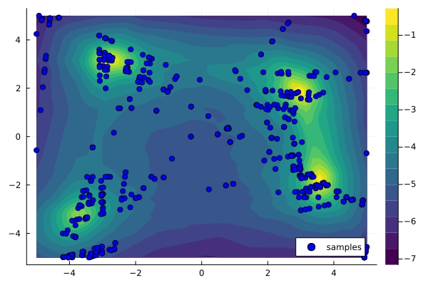
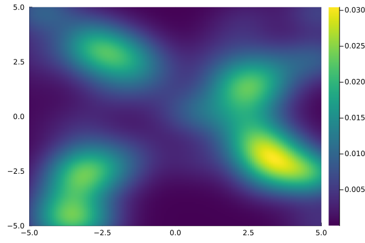
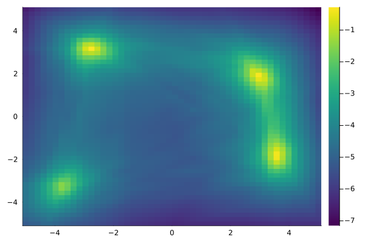

# Relaxing walk - limiting the number of samples

This short article investigates the relaxing walk -algorithm introduced by Tong et al. (2024) and tries to improve it.
The improvements are based on the key observation that many of the linear relaxation models produced in the sampling phase are near-constant or infeasible.

## The neural network

Testing was done on a neural network trained to approximate an altered Himmelblau's function. 
The function has four maxima but due to the inaccuracies introduced by the training process, our network has a true maximum at around (-3, 3).

The network has structure 2-100-100-1, i.e., 2 hidden layers of 100 neurons.

> Output of the neural network

## Fixing binary variables

The relaxing walk algorithm consists of two parts: sampling and local search.
The sampling part is based on starting with a linear relaxation (LR) of the original model and then fixing binary variables layer-by-layer, one-by-one, in random order, producing different LR models. From each LR model, the maximum is used as a starting point for the local search algorithm.

The following images show the how the LR models change as more and more binary variables become fixed.
There are 200 individual plots in each image corresponding to the 200 binary variables (one for each neuron in a hidden layer).

Six runs were performed in total.

### 1.

### 2.

### 3.

### 4.

### 5.

### 6.

From the images it can be seen that most of the LR models are near constant or very different from the function of interest.
This means that their maxima will not be good starting points for the local search algorithm.
Many of the LR models are actually infeasible as well and time is wasted trying to optimize them.

However, usually the first few LR models seem reasonably good.
Therefore, it might be beneficial to only use the first few LR models for sampling and then start a new iteration (reset binary variables).

## Limited number of samples per iteration

When limiting the sample count to 3 per iteration, this is what the relaxing walk algorithm will sample and local search in 10 iterations (taking 3.8 seconds). There are 30 sampled points in total.

The samples are somewhat focused near the maxima which is desirable.

All of the optima are found with the local search using these samples as starting points:

The clustering becomes more evident as more iterations are run.
These are the unique samples (192) from 100 iterations with max 3 samples per iteration. This run took about 35 seconds.

### Comparison with all samples per iteration

Doing 10 iterations with no limit on samples produces only slightly more unique samples (41) but the time is doubled to 8 seconds.

The no-limit sampling can only complete 3 iterations in the same time  as the limited sampling (~4 seconds).

With fewer iterations, the samples _might_ not cover the domain as well. Not all extrema are found in this case.

### Sampling efficiency

Here is another example of the sampled points when 300 iterations were used with maximum 3 samples per iteration. This resulted in 541 unique points which are plotted here.

When comparing the sample point density heatmap (above) to the neural network output heatmap (below), it can be seen that the sampling algorithm heavily biases points near the extrema.

'

## Conclusions

Limiting the number of samples per iteration might make the relaxing walk algorithm perform better, i.e., sample a more balanced set of points from the domain that is focused near the extrema in the same time compared to the "no-limit" sampling. Here a more balanced set means that samples will be taken around every extrema, not focused in one part of the domain.

These results might be totally different in higher dimensions, for example. There it might be more beneficial to continue fixing the binary variables further. More testing is needed comparing the performance of the "limited" and "no-limit" sampling strategies with different neural network architectures, multiple dimensions and different testing functions.

## References

*Tong, J., Cai, J., & Serra, T. (2024). Optimization Over Trained Neural Networks: Taking a Relaxing Walk. arXiv preprint arXiv:2401.03451.*